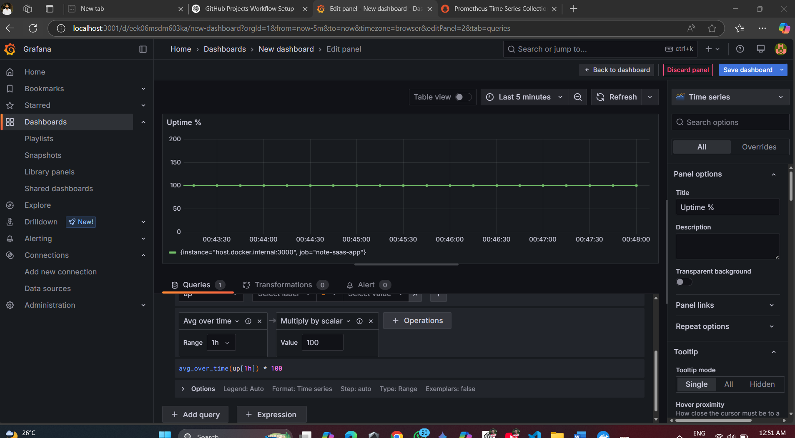
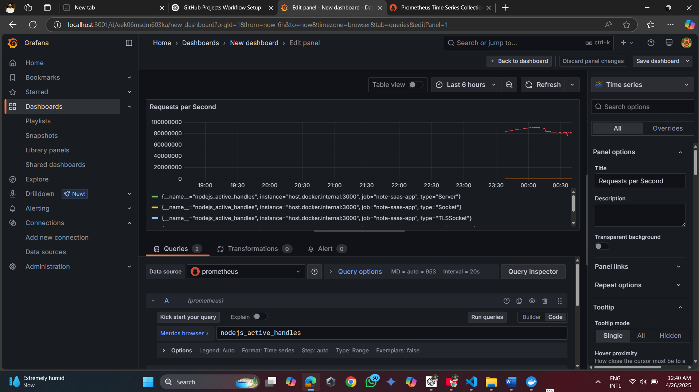

# 📊 Service Level Objectives (SLO) Monitoring

This document describes the Service Level Objectives (SLOs) for the Note SaaS application and how they are monitored using Prometheus and Grafana.

---

## 🎯 Defined SLOs

### 1. 🔁 **Uptime**
- **Objective**: Instance should be up 99.9% of the time.
- **Prometheus Query**:
  ```promql
  avg_over_time(up[1h]) * 100
  ```
- **Grafana Panel**:
  - Title: `Instance Uptime (%)`
  - Threshold: `99.9%`



---

### 2. ✅ **Requests per Second (RPS)**
- **Objective**: Ensure the application can handle at least 100 requests per second.
- **Prometheus Query**:
  ```promql
  sum(rate(http_requests_total[1m]))
  ```



---

### 3. ✅ **Latency (Response Time)**
- **Objective**: 95% of requests should respond in under 300ms.
- **Prometheus Query**:
  ```promql
  histogram_quantile(0.95, sum(rate(http_request_duration_seconds_bucket[5m])) by (le))
  ```
- **Grafana Panel**:
  - Title: `95th Percentile Latency`
  - Threshold: `0.3` seconds

---

### 4. ❌ **Error Rate (5xx Errors)**
- **Objective**: Less than 0.1% of total requests return 5xx errors.
- **Prometheus Query**:
  ```promql
  sum(rate(http_requests_total{status=~"5.."}[5m])) / sum(rate(http_requests_total[5m])) * 100
  ```
- **Grafana Panel**:
  - Title: `5xx Error Rate (%)`
  - Threshold: `0.1%

---

## 📈 Dashboard Setup in Grafana

1. Go to http://localhost:3001
2. Login with `admin/admin`
3. Create or edit a dashboard
4. Click “Add Panel” → Add the above queries
5. Save your dashboard as `SLO Overview`

---

