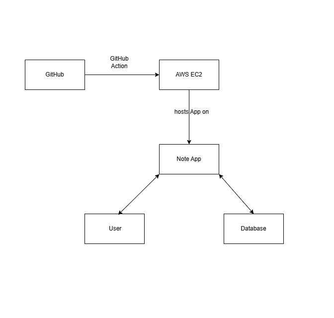
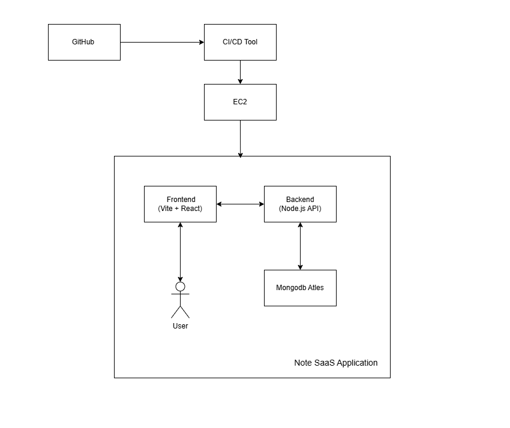
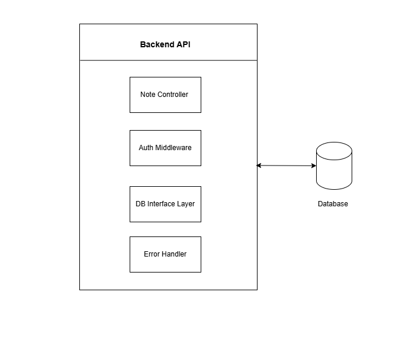

# 📄 Technical Design Document (TDD) — Note App

---

## 1. System Overview

The Note App is a lightweight Micro SaaS solution that enables users to create, edit, and delete personal notes securely.  
It focuses on simplicity, speed, and accessibility, providing a smooth note-taking experience on web browsers.

---

## 2. C4 Model Diagrams

- **Context Diagram**  
  - Users interact with the Note App through a web interface.
  - The application is hosted on a cloud server.
  - A cloud database stores the notes.
  
  

- **Container Diagram**  
  - Frontend (Web App - built using Next.js) communicates with Backend API.
  - Backend (FastAPI/Node.js) handles authentication, CRUD operations.
  - Database (MongoDB) stores notes securely.
  
  

- **Component Diagram**  
  - The frontend is divided into components for note listing, note editing, and user authentication.
  - The backend is divided into modules for authentication, note management, and database interaction.
  
  

---

## 3. Tech Stack and Justifications

| Layer        | Technology | Reason |
|--------------|------------|--------|
| Frontend     | **Next.js** (React Framework) | Fast rendering, SSR/SSG capabilities |
| Backend      | **Express** (Node.js) | Lightweight, high-performance APIs |
| Database     | **MongoDB Atlas** | NoSQL, easy scalability for unstructured data like notes |
| Hosting      | **AWS EC2** | Flexible deployment for SaaS applications |
| Authentication | **JWT + OAuth** | Secure user authentication |

---

## 4. CI/CD Overview

- **GitHub Actions** for automated builds, tests, and deployment.
- **CI Steps**:
  - Linting and code formatting checks
  - Unit and integration tests
- **CD Steps**:
  - Build and deploy frontend to Vercel
  - Deploy backend API to AWS EC2 (or similar)
- **Branch Protection**:
  - `main` branch protected with code reviews and checks.

---

## 5. Security Considerations

- **Authentication**: JWT tokens to secure APIs.
- **Authorization**: Role-based access if needed (e.g., admin vs. user).
- **Input Validation**: Protect backend APIs against injections.
- **Data Encryption**: Sensitive data encrypted at rest (MongoDB Atlas) and in transit (HTTPS).
- **Security Scanning**: GitHub Dependabot & CodeQL integrated for SAST.

---

## 6. Infrastructure Setup Overview (IaC)

- **Infrastructure-as-Code** using **Terraform** or **AWS CDK**:
  - Define AWS EC2 instance
  - Set up MongoDB Atlas cluster
  - Configure security groups (firewalls)
  - Automate domain and SSL certificate creation

---
